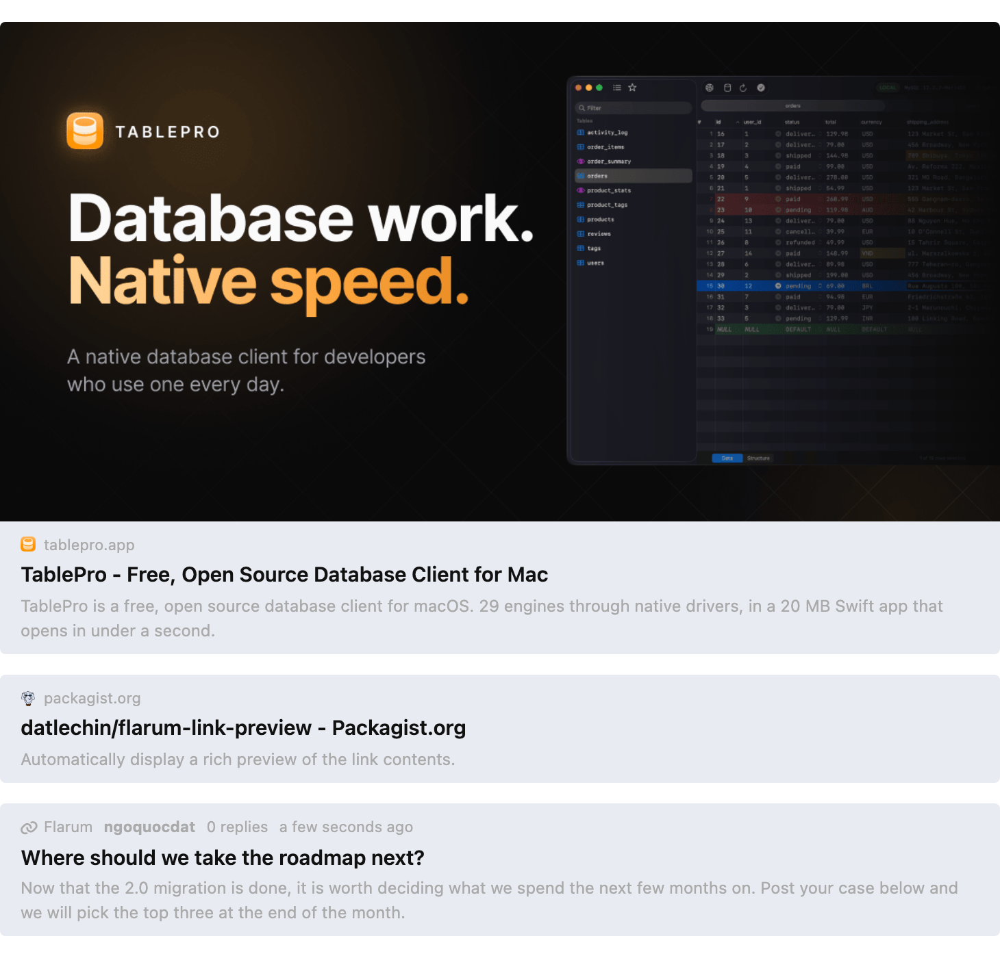
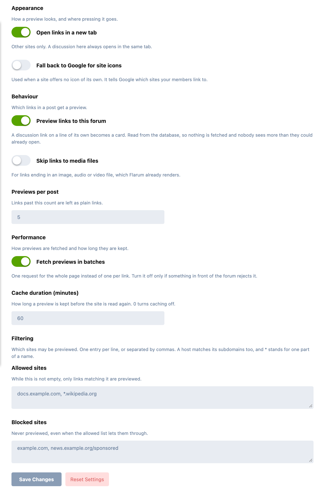

# Link Preview

[](LICENSE.md) [](https://packagist.org/packages/datlechin/flarum-link-preview) [](https://packagist.org/packages/datlechin/flarum-link-preview) [](https://github.com/sponsors/datlechin)

Paste a link in a post and it becomes a card with the page's title, description and image. Your forum reads the page itself, so nothing is sent to a third party.



## Install

```sh
composer require datlechin/flarum-link-preview:"*"
```

Updating:

```sh
composer update datlechin/flarum-link-preview:"*"
php flarum migrate
php flarum cache:clear
```

Needs Flarum 2.0 and PHP 8.2.

## What gets a card

Only a pasted address, meaning the link's text is the address itself. `[the docs](https://example.com)` keeps the words you wrote.

Left alone: mentions, quotes and code, media files if you ask, links past the per-post limit, and anything your lists rule out.

A link to a discussion here gets a card built from the database, not fetched, showing its title, author and reply count. Readers only see discussions they could already open. It has to be alone on its line; inside a sentence Flarum's own `#12` label is better.

Members can turn previews off for themselves in their settings.

## Settings



The two lists take one entry per line or separated by commas:

| Entry | Matches |
| --- | --- |
| `example.com` | that host and its subdomains |
| `example.com/news` | that path and everything under it |
| `*.example.com` | one label in front of the domain |

Anchored at both ends, so `example.com` does not match `notexample.com.evil.org`.

## Security

Anyone who can read a post can ask your server to fetch a URL, so:

- Loopback, private and reserved addresses are refused, IPv4 and IPv6. The connection is pinned to the address that was checked, so DNS cannot swap in an internal one afterwards.
- Redirects are followed by hand, three hops at most, each one checked again.
- `http` and `https` only. TLS is always verified.
- 1 MiB and 8 seconds per page, 30 requests a minute per member.
- Failures are cached too, so a dead domain is not retried on every page view.

Older versions could fall back to a third-party oEmbed service. That sent your members' links to someone else's server, so it is gone.

## Links

- [Packagist](https://packagist.org/packages/datlechin/flarum-link-preview)
- [Discuss](https://discuss.flarum.org/d/30011)
